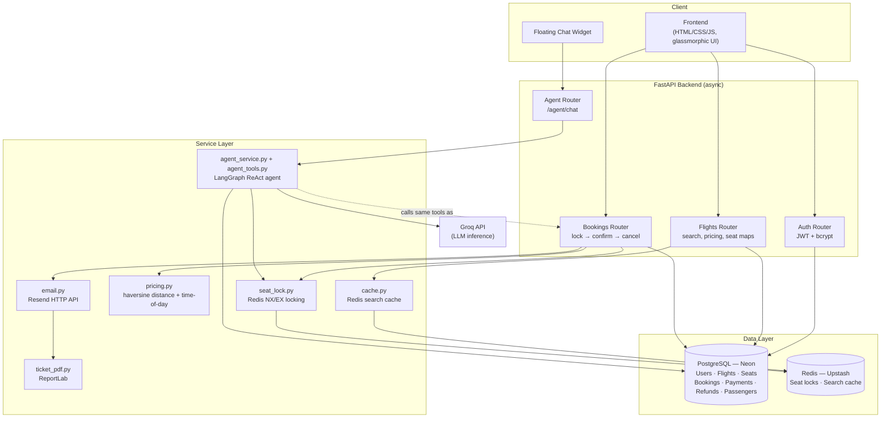
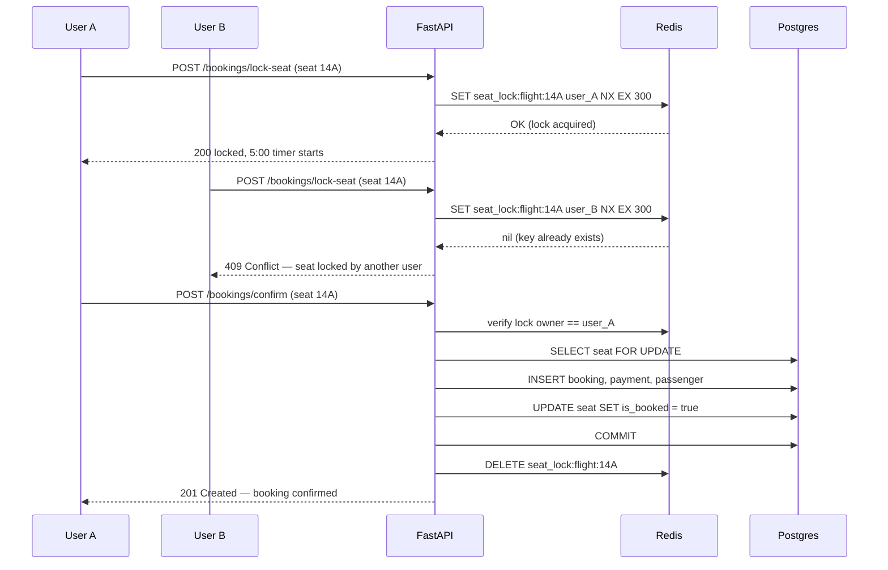
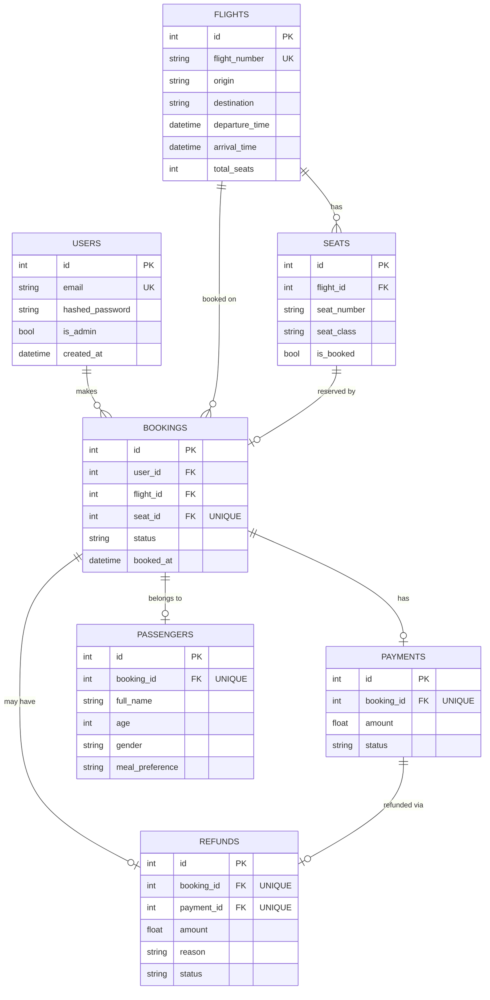
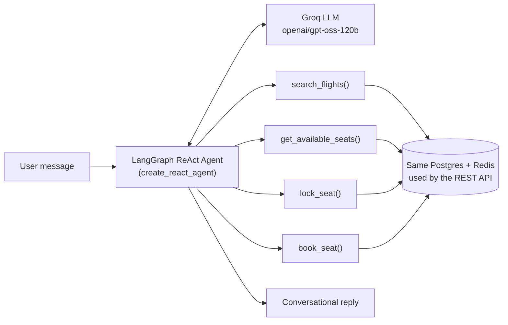

# SkyLock ✈️

**A backend-heavy flight booking system built to demonstrate real-world concurrency handling, transactional integrity, and applied AI agent design.**

> 🔗 **Live demo:** `https://skylock-frontend-m3fw.onrender.com`
> 🔗 **API docs:** `https://skylock-api-24gd.onrender.com/docs`
> ⚠️ Free-tier hosting: first request after ~15 min idle may take 30–60s to wake up.

---

## Table of Contents

1. [Why This Project Exists](#why-this-project-exists)
2. [System Architecture](#system-architecture)
3. [The Core Problem: Concurrent Seat Booking](#the-core-problem-concurrent-seat-booking)
4. [Database Design](#database-design)
5. [Tech Stack](#tech-stack)
6. [Feature List](#feature-list)
7. [AI Booking Assistant (LangChain + Groq)](#ai-booking-assistant-langchain--groq)
8. [API Reference](#api-reference)
9. [Security](#security)
10. [Setup & Local Development](#setup--local-development)
11. [Known Limitations](#known-limitations)
12. [What I'd Build Next](#what-id-build-next)
13. [Interview Talking Points (Quick Reference)](#interview-talking-points-quick-reference)

---

## Why This Project Exists

Most CRUD backends never force you to deal with a real race condition. Flight booking does — **what happens when two users try to book the same seat at the exact same moment?**

This project exists to answer that question properly: not with a single database `UNIQUE` constraint and a shrug, but with a deliberate, two-layer defense — an atomic **Redis distributed lock** for fast UX feedback, backed by a **Postgres row-level lock inside an ACID transaction** as the actual source of truth. Redis can fail, expire, or be wrong; Postgres cannot lie about what's committed.

On top of that core problem, the project layers on the things a production backend actually needs: authentication & RBAC, dynamic pricing, group bookings, PDF generation, transactional emails, caching, rate limiting — and, on top of all of it, a **LangChain + Groq tool-calling AI agent** that can search and book flights through natural conversation, using the exact same booking logic and safety guarantees as the REST API.

---

## System Architecture



**Design principle:** the AI agent doesn't get its own parallel booking logic — its tools (`agent_tools.py`) call into the _same_ seat-locking and transaction code the REST API uses. This means the agent inherits every safety guarantee (Redis lock + Postgres `FOR UPDATE` + `IntegrityError` fallback) for free, rather than needing to be trusted separately.

---

## The Core Problem: Concurrent Seat Booking

### The interview question this project answers

> _"Two users try to book the same seat simultaneously. What happens?"_

### The flow



### Why two layers, not one

| Layer                                         | Purpose                                                                                     | What it protects against                                                                                                                                                                                                    |
| --------------------------------------------- | ------------------------------------------------------------------------------------------- | --------------------------------------------------------------------------------------------------------------------------------------------------------------------------------------------------------------------------- |
| **Redis `SET NX EX`**                         | Atomic check-and-set in a single indivisible operation; no window between "check" and "set" | Gives instant `409` feedback to the losing user without touching the database — fast UX                                                                                                                                     |
| **Postgres `SELECT ... FOR UPDATE`**          | Row-level lock inside the confirm transaction                                               | Catches the case where the Redis lock expired mid-flow, or was never checked at all (e.g. a bug, or the AI agent calling tools directly)                                                                                    |
| **`UNIQUE` constraint on `bookings.seat_id`** | Database-enforced, cannot be bypassed by any application code path                          | The final, unconditional guarantee — if every other layer somehow fails, the DB itself refuses a duplicate booking and raises `IntegrityError`, which the API catches and returns as a clean `409` instead of a `500` crash |

**This is proven, not just claimed** — `scripts/concurrency_test.py` fires two simultaneous requests at the same seat and asserts exactly one succeeds:

```bash
python scripts/concurrency_test.py <flight_id> <seat_id> <token_user_a> <token_user_b>
```

---

## Database Design



**Key design decisions:**

- `Refund` is a **separate table**, not a status flag on `Payment` — gives a real audit trail (amount, reason, timestamp) instead of losing history on cancellation.
- `Passenger` is **one-to-one with `Booking`**, not columns bolted onto `Booking` — proper normalization, and naturally extends to per-seat passenger data in group bookings.
- Every FK that should be unique (`seat_id` on `Booking`, `booking_id` on `Payment`/`Refund`/`Passenger`) has an explicit `UNIQUE` constraint — this is what makes the "final guarantee" layer in the concurrency table above actually true.
- Migrations are managed with **Alembic**, versioned and reproducible (`alembic upgrade head`), including a real example of handling a `NOT NULL` column addition against existing data via `server_default`.

---

## Tech Stack

| Layer            | Choice                                                  | Why                                                                                 |
| ---------------- | ------------------------------------------------------- | ----------------------------------------------------------------------------------- |
| API framework    | **FastAPI** (async)                                     | Native async I/O, automatic OpenAPI docs, dependency injection for auth/DB sessions |
| Database         | **PostgreSQL** (Neon, serverless)                       | ACID transactions, row-level locking, relational integrity                          |
| ORM              | **SQLAlchemy 2.0** (async) + **Alembic**                | Async-native queries, versioned migrations                                          |
| Cache / locking  | **Redis** (Upstash, REST-based)                         | Atomic `SET NX EX` for distributed locks; also used for search-result caching       |
| Auth             | **JWT** (`python-jose`) + **bcrypt** (`passlib`)        | Stateless sessions, salted password hashing, standard OAuth2 password flow          |
| AI orchestration | **LangChain / LangGraph** + **Groq** (Llama/OSS models) | Free, fast inference; tool-calling agent architecture                               |
| Email            | **Resend** (HTTP API)                                   | SMTP ports are blocked on most free hosting tiers; HTTP API sidesteps that          |
| PDF generation   | **ReportLab**                                           | Real boarding-pass PDFs, generated on demand and emailed as attachments             |
| Frontend         | Vanilla HTML/CSS/JS                                     | No build step, glassmorphic design system, fully responsive                         |
| Deployment       | **Render** (free tier, both services)                   |                                                                                     |

---

## Feature List

- **Auth**: register/login, JWT, bcrypt hashing, role-based access control (admin-gated flight creation)
- **Flight search**: origin/destination/date filtering, pagination, Redis-cached results with write-invalidation
- **Dynamic pricing**: haversine distance between airports × seat class multiplier × time-of-day surcharge — not flat pricing
- **Seat selection**: auto-generated seat maps (business/economy), live lock-status visibility across users
- **Seat locking**: atomic Redis `NX EX` distributed lock, 5-minute TTL, ownership-verified release
- **Booking confirmation**: Postgres `FOR UPDATE` transaction + `IntegrityError` safety net
- **Group/multi-seat booking**: lock and book N seats atomically in a single transaction — all-or-nothing, with per-seat passenger details
- **Passenger management**: dedicated table (name, age, gender, meal preference), one-to-one per booking
- **Payment simulation**: fare calculated per seat, real `Payment` records
- **Cancellation + refund**: proper `Refund` record (not just a status flag) — amount, reason, timestamp
- **PDF ticket generation**: on-demand boarding pass download, and auto-attached to confirmation emails
- **Transactional email**: booking confirmation (with PDF) and cancellation notices, sent via Resend, non-blocking (`BackgroundTasks`)
- **Rate limiting**: per-route limits on login/register/lock-seat via `slowapi`
- **Consistent error handling**: global exception handlers, uniform `{success, error}` response shape across all endpoints
- **Structured logging**: business-event logs separated from raw SQL logs
- **AI booking agent**: full natural-language search-to-booking flow (see below)

---

## AI Booking Assistant (LangChain + Groq)

### What it does

A floating chat widget lets users book flights conversationally — _"book me a flight from Delhi to Mumbai next Friday"_ — instead of clicking through search → seat map → form. The agent handles multi-turn conversation: presenting options, asking clarifying questions, collecting passenger details, and confirming before it commits anything.

### Architecture



### Key design decisions

**1. Tools wrap real backend logic — the agent has no separate code path.**
`lock_seat` and `book_seat` (agent tools) call the identical `acquire_seat_lock()` and transactional booking logic the REST API uses. The agent isn't a thin wrapper around a chatbot that _describes_ booking — it _performs_ the same Redis-lock-then-Postgres-transaction flow, with the same `IntegrityError` fallback.

**2. Authorization is enforced by tool availability, not by prompting.**

```python
def build_tools(db, current_user):
    read_only_tools = [search_flights, get_available_seats]
    if current_user is None:
        return read_only_tools          # guests literally cannot book — no tool exists to call
    return read_only_tools + [lock_seat, book_seat]
```

A guest user's LLM session has no `book_seat` tool in its available function list at all — this is a structural guarantee, not "the model was told not to." Telling an LLM not to do something via prompt is a soft constraint; not giving it the tool is a hard one.

**3. Confirmation checkpoint before any state-changing call.**
The system prompt requires the agent to restate the exact seat, flight, and passenger details and get explicit user confirmation before calling `book_seat` — mitigating tool-argument hallucination (a known failure mode where an LLM can generate a syntactically valid tool call with subtly wrong argument values, e.g. mixing up passenger details from earlier in a long conversation).

**4. Audit logging independent of the model's own narration.**
Every `lock_seat`/`book_seat` call logs its actual received arguments server-side — giving a ground-truth record of what the model _did_, separate from what it _said_ it did in the chat reply.

**5. Groq model choice was empirical, not arbitrary.**
`llama-3.3-70b-versatile` intermittently emitted malformed `<function=name{args}>` text instead of using Groq's structured tool-calling protocol, causing `400` errors mid-conversation. Switching to `openai/gpt-oss-120b` at `temperature=0` resolved this — a real example of model selection being driven by empirical tool-calling reliability, not just benchmark scores.

**6. Resilience**: one automatic retry on a failed tool-call generation, plus a `recursion_limit` on the agent graph to hard-cap runaway tool-calling loops.

---

## API Reference

| Method | Route                     | Auth     | Description                                                              |
| ------ | ------------------------- | -------- | ------------------------------------------------------------------------ |
| POST   | `/auth/register`          | —        | Create account                                                           |
| POST   | `/auth/login`             | —        | OAuth2 password flow → JWT                                               |
| GET    | `/flights/`               | —        | Search (origin, destination, date, pagination) — cached                  |
| GET    | `/flights/{id}`           | —        | Flight detail, seat map with live lock status + price per seat           |
| POST   | `/flights/`               | Admin    | Create flight (auto-generates seat map)                                  |
| POST   | `/bookings/lock-seat`     | User     | Acquire a temporary Redis lock on one seat                               |
| POST   | `/bookings/lock-seats`    | User     | Lock multiple seats (group booking, all-or-nothing)                      |
| POST   | `/bookings/confirm`       | User     | Confirm + pay for a locked seat, with passenger details                  |
| POST   | `/bookings/confirm-group` | User     | Confirm a multi-seat group booking                                       |
| GET    | `/bookings/me`            | User     | List my bookings (payment, refund, passenger, flight — all eager-loaded) |
| POST   | `/bookings/{id}/cancel`   | User     | Cancel + create a refund record                                          |
| GET    | `/bookings/{id}/ticket`   | User     | Download PDF boarding pass                                               |
| POST   | `/agent/chat`             | Optional | Conversational search (guest) or full booking (logged in)                |

Full interactive docs at `/docs` (Swagger UI, auto-generated from the FastAPI schema).

---

## Security

- Passwords hashed with **bcrypt**, never stored or logged in plaintext
- **JWT** with expiry (`exp` claim), verified on every protected route via FastAPI dependency injection
- **RBAC**: `is_admin` flag gates flight creation — checked server-side, never trusted from client input
- **Rate limiting** on login/register/seat-locking to blunt brute-force and spam
- **CORS** locked to the deployed frontend origin in production (not `*`)
- Secrets (`DATABASE_URL`, JWT secret, Redis/email/Groq API keys) live only in environment variables — never committed to the repo
- Global exception handlers ensure unhandled errors return a generic `500` message, never a leaked stack trace

---

## Setup & Local Development

```bash
git clone <your-repo-url>
cd SkyLock
python -m venv venv
venv\Scripts\activate          # Windows; use `source venv/bin/activate` on macOS/Linux
pip install -r requirements.txt

cp .env.example .env           # fill in your own Neon / Upstash / Resend / Groq credentials

alembic upgrade head
python -m scripts.seed_flights # seeds ~30 sample Indian-route flights

uvicorn app.main:app --reload
```

Visit `http://127.0.0.1:8000/docs` for the API, and open `index.html` (Live Server or direct) for the frontend — set the API Base URL field to match.

**Required environment variables:**

```
DATABASE_URL=
UPSTASH_REDIS_REST_URL=
UPSTASH_REDIS_REST_TOKEN=
SECRET_KEY=
RESEND_API_KEY=
RESEND_FROM_EMAIL=
GROQ_API_KEY=
```

---

## Known Limitations

Being upfront about these is deliberate — they're real tradeoffs of building on free-tier infrastructure, not hidden bugs:

- **Free-tier cold starts**: Render's free web services spin down after ~15 min idle; the first request afterward takes 30–60s to wake up.
- **Neon cold starts**: similarly, an idle Postgres instance adds latency to the first query after inactivity.
- **Email delivery**: on Resend's free tier without a verified custom domain, delivery is restricted to the account's own verified email address.
- **Fare "taxes & fees" breakdown** in the PDF/email is a cosmetic display split (94%/6%) for realism — the pricing engine only computes one final fare; a true breakdown would need separate `base_fare`/`taxes` columns computed at pricing time.
- **No real-time seat map sync (yet)**: another user's lock only becomes visible to you on your next `GET /flights/{id}` call, not pushed live — a WebSocket layer would close this gap.

---

## What I'd Build Next

- WebSocket-based live seat map updates (push `seat_locked`/`seat_booked` events to all viewers of a flight)
- CI pipeline (GitHub Actions running `pytest` + lint on every push)
- Real fee/tax breakdown stored at pricing time, not derived cosmetically
- Load-testing results (`locust`/`k6`) documented alongside the concurrency proof
- Retrieval-augmented support chatbot for policy/FAQ questions, using the same Groq infra

---

## Interview Talking Points (Quick Reference)

**"Walk me through what happens if two users book the same seat at once."**
→ Redis atomic `SET NX EX` gives instant feedback to the loser without a DB round trip. The winner's confirm step re-verifies via Postgres `SELECT FOR UPDATE`, and a `UNIQUE` constraint on `bookings.seat_id` is the final, unconditional guarantee — caught as `IntegrityError` and returned as a clean `409`, not a crash. Proven with a script that fires two real concurrent requests.

**"Why Redis and not just Postgres alone?"**
→ Redis is the UX/speed layer (in-memory, single atomic op, instant lock feedback); Postgres remains the actual source of truth. Redis failing or expiring never risks a double-booking — it only risks a slightly worse user experience, because Postgres still enforces correctness underneath it.

**"How does the AI agent stay safe / not book things it shouldn't?"**
→ Authorization is enforced by _which tools exist in the LLM's function list_, not by prompt instructions. A guest session literally has no `book_seat` tool to call. The agent's tools also call the same transactional logic as the REST API, so it inherits the same lock/constraint guarantees rather than needing separate trust.

**"What was the hardest bug you hit?"**
→ Async SQLAlchemy lazy-loading relationships outside a greenlet context (`MissingGreenlet`) when FastAPI tried to serialize ORM objects with un-eager-loaded relationships — fixed by consistently using `selectinload()` on every response-returning query. A good example of an async-specific class of bug that doesn't exist in sync codebases.

**"How would you scale this?"**
→ Move off free-tier cold-start-prone hosting; add read replicas for search-heavy `GET /flights` traffic; move seat-lock TTL logic to a more sophisticated distributed lock (Redlock) if running multi-node Redis; add the WebSocket layer for live seat-map sync instead of poll-on-view.

---

_Built as a demonstration of backend system design, concurrency correctness, and applied LLM agent architecture — not a production airline system._
